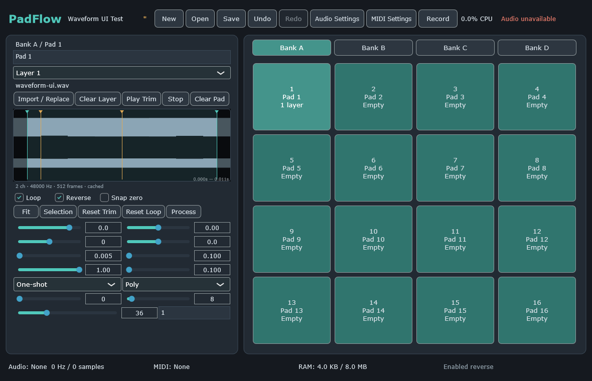
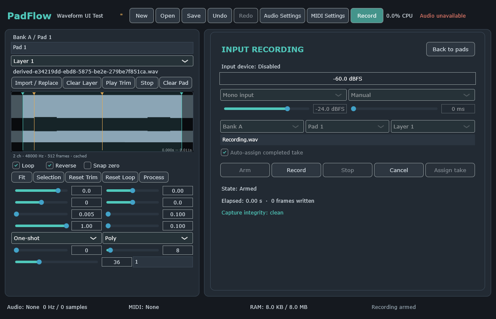

# PadFlow

PadFlow is an original, offline, standalone desktop sampler project by Ali Ammar Audio. Version
0.1.0 contains the playable RAM-resident sampler plus Milestone 2 non-destructive waveform editing
and recording: four banks of sixteen pads, four velocity layers per pad, WAV/AIFF/FLAC import and
preview, mouse/keyboard/MIDI triggering, deterministic 128-voice playback, device settings,
frame-bound trim/loop/reverse, derived PCM operations, input capture, and schema-v1 project
save/load.

## Status and platforms

- Target: Windows 10/11 x64 and macOS 12+ arm64/x86_64/universal.
- Technology: C++20, CMake 3.28+, pinned JUCE 8.0.13.
- Current reference status: `BLOCKED_REFERENCE_ASSET` because the supplied MP4 is empty.
- No Resamplr branding, artwork, samples, or exact interface is included or claimed.

## Source checkout

```bash
git clone --recursive <repository-url>
cd PadFlow
git submodule update --init --recursive
```

Install CMake 3.28+, Ninja, Python 3.11+, and a supported compiler: a current Visual Studio with MSVC
on Windows, or Xcode on macOS. Run Windows presets from a Visual Studio developer shell. The JUCE
submodule is pinned; dependency upgrades happen only at milestone boundaries.

## Configure, build, and test

```bash
cmake --preset tests-debug --fresh
cmake --build --preset tests-debug
ctest --preset tests-debug --output-on-failure
```

Use `windows-debug`, `windows-release`, `macos-debug`, `macos-release`,
`macos-universal-release`, or `macos-intel-release` on the matching host. See
`docs/DEVELOPER_GUIDE.md` for exact commands.

Smoke paths:

```bash
padflow_smoke
PadFlow --headless-smoke-test --no-audio-device
```

They generate a temporary WAV, import and analyse it through bounded worker paths, edit and render
trim/reverse/loop playback, create normalize/crop derived assets without changing the source,
round-trip a populated schema-v1 project, record mocked input through the capture FIFO/writer,
assign and retrigger the WAV, verify undo/redo, and clean temporary files. No physical audio, MIDI,
or input device is required.

## Waveform editing and recording

Select a loaded layer to use its cached waveform editor. Teal markers delimit the inclusive/exclusive
trim range, amber markers delimit the loop, and the coral playhead follows callback-published
position data. Drag markers or select one and use the arrow keys; Shift+arrow performs a coarse
nudge. The wheel zooms around the cursor, middle/right drag pans, and the Fit and Selection buttons
restore useful views. Loop, Reverse, zero-crossing preference, audition, reset, and process controls
commit through the project controller and remain undoable.

The Process menu creates a new project-owned WAV for Normalize, Stereo to mono, Fade in, Fade out,
or Crop. The source is never overwritten. Normalize defaults to -1 dBFS, stereo conversion uses
`(left + right) * 0.5`, fades are linear, and crop uses the active half-open trim range.

Open Record to choose input channels, Manual or Threshold mode, threshold, 0–2000 ms pre-roll,
destination bank/pad/layer, and automatic assignment. Arm prepares bounded storage; Record starts a
manual take, while threshold mode waits for a crossing. Stop drains and validates a 24-bit WAV on
the writer thread. Cancel, device/project changes, overflow, or shutdown never publish an incomplete
take. A completed non-auto-assigned take remains available through Assign take.

CI-generated Milestone 2 UI evidence:





## Installation, settings, and projects

Development archives are unsigned and contain `UNSIGNED.txt`. Production installers and DMG
publication arrive in Milestone 10. Gatekeeper or SmartScreen may warn about unsigned development
builds.

Planned settings locations:

- Windows: `%APPDATA%\Ali Ammar Audio\PadFlow`
- macOS: `~/Library/Application Support/Ali Ammar Audio/PadFlow`

Projects use the `.padflow` extension; the schema contract is documented in
`docs/PROJECT_FORMAT.md`.

## Optional integrations

FFmpeg is disabled by default and will use only a user-installed executable after licensing review.
ASIO is disabled and no SDK is bundled. Neither is required for the application foundation.

## CI, packaging, signing, and licences

See `docs/GITHUB_ACTIONS.md`, `docs/SIGNING.md`, and `THIRD_PARTY_LICENSES.md`. Ordinary CI does not
require signing credentials or audio hardware. Report defects with platform, build preset, exact
steps, logs, and a minimal redistributable project where possible.
