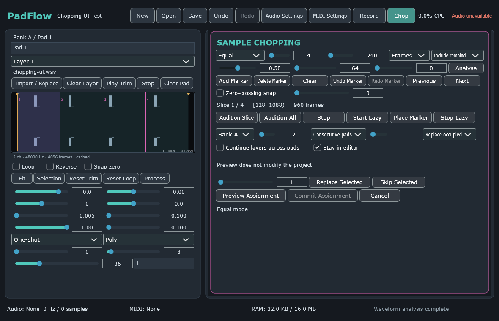
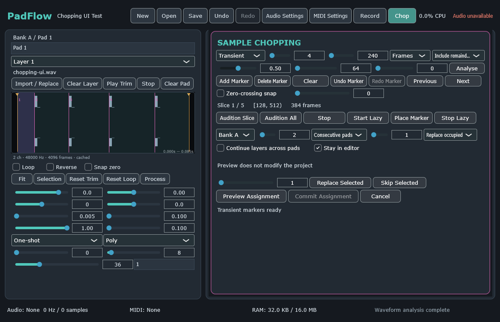
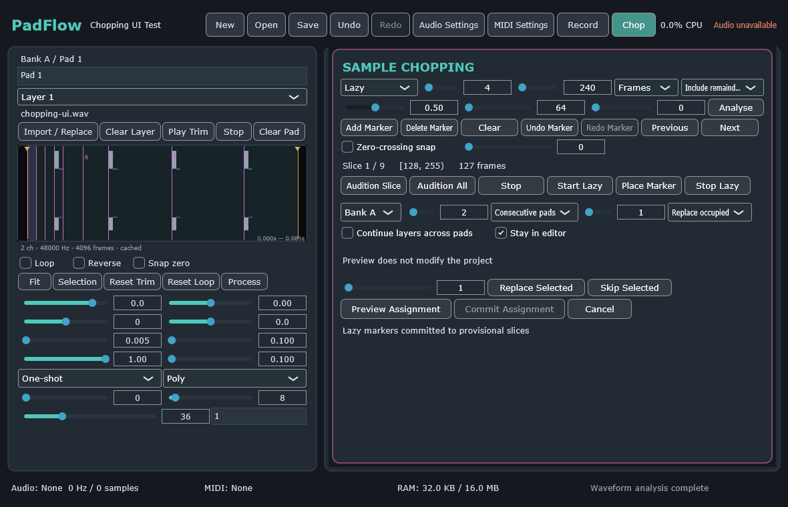
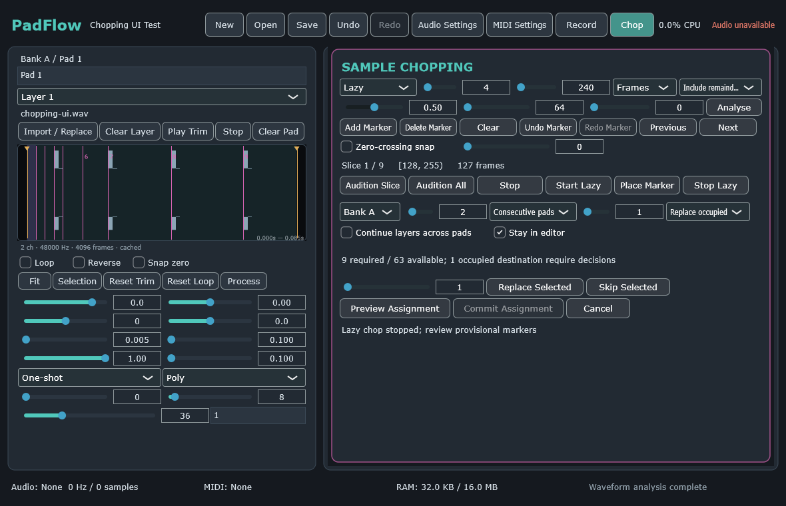

# PadFlow

PadFlow is an original, offline sampler project by Ali Ammar Audio. Version
0.1.0 contains the playable RAM-resident sampler, waveform editing/recording, non-destructive
sample chopping, and the Milestone 4 pattern sequencer: four banks of twelve pads, four velocity layers per
pad, WAV/AIFF/FLAC import and preview, mouse/keyboard/MIDI triggering, deterministic 128-voice
playback, device settings, frame-bound trim/loop/reverse, derived PCM operations, input capture,
five chopping modes, transactional slice assignment, deterministic transport/pattern playback,
step/live pattern recording, and schema-v1 project save/load. Desktop builds include a standalone
application and VST3 instrument; macOS builds also include an AU v2 instrument.

## Status and platforms

- Validated target: Windows 10/11 x64 and macOS 12+ arm64/x86_64/universal. Touch-first iOS and
  Android delivery is approved for the dedicated mobile milestone.
- Technology: C++20, CMake 3.28+, pinned JUCE 8.0.13.
- Current reference status: `BLOCKED_REFERENCE_ASSET` because the supplied MP4 is empty.
- No Resamplr branding, artwork, samples, or exact interface is included or claimed.

## Source checkout

```bash
git clone --recursive <repository-url>
cd PadFlow
git submodule update --init --recursive
```

Install CMake 3.28+, Ninja, Python 3.11+, and a supported compiler: a current Visual Studio with MSVC
on Windows, or Xcode on macOS. Run Windows presets from a Visual Studio developer shell. The JUCE
submodule is pinned; dependency upgrades happen only at milestone boundaries.

## Configure, build, and test

```bash
cmake --preset tests-debug --fresh
cmake --build --preset tests-debug
ctest --preset tests-debug --output-on-failure
```

Use `windows-debug`, `windows-release`, `macos-debug`, `macos-release`,
`macos-universal-release`, or `macos-intel-release` on the matching host. See
`docs/DEVELOPER_GUIDE.md` for exact commands.

Smoke paths:

```bash
padflow_smoke
PadFlow --headless-smoke-test --no-audio-device
padflow_plugin_smoke
```

They generate temporary synthetic WAV data, import and analyse it through bounded worker paths,
edit and render trim/reverse/loop playback, create normalize/crop derived assets without changing
the source, record mocked input through the capture FIFO/writer, exercise equal, fixed, transient,
manual, and simulated lazy chopping, preview and transactionally assign shared-PCM slices,
round-trip a populated schema-v1 project, retrigger restored slices, verify undo/redo and
cancellation, deterministic multi-buffer sequence playback, step/live takes, and clean temporary
files. No physical audio, MIDI, or input device is required.

## Transport and pattern sequencer

Open Sequence to use the internal Play, Stop, Record, Panic, Loop, Metronome, Count-in, and BPM
controls. The pattern header creates, selects, renames, duplicates, deletes, or clears patterns.
The scrollable grid exposes all 48 pad lanes; click any of the sixteen visible steps to add or remove
an event. Selected events expose velocity, probability, ratchet count, and signed timing nudge.

Record starts a bounded live overdub after the configured count-in. Mouse, computer keyboard, and
MIDI all enter the same capture queue, and note release determines gate duration. Press Record again
to commit the complete take as one undo entry, or Panic/cancel to discard it. Stored musical time is
960 PPQ with Q16 fractions; project files never persist callback frame offsets or mutable RNG state.

## Sample chopping

Open Chop on a loaded layer to create provisional slices inside its active half-open trim range.
Equal mode uses deterministic integer division; Fixed Length uses source frames internally and can
include or discard a remainder; Transient analyses immutable PCM on a background worker; Manual
edits waveform markers directly; and Lazy captures bounded mouse, keyboard, MIDI, or explicit
marker events against the audition playhead.

Previewing an assignment does not change the project. The preview reports capacity and every
occupied pad/layer before commit, and requires explicit replace/skip decisions. A successful
consecutive-pad or consecutive-layer assignment is one atomic undoable transaction. Assigned
layers reference the original immutable PCM with their own slice bounds, so chopping does not copy
or overwrite source audio.

CI-generated Milestone 3 UI evidence:









## Waveform editing and recording

Select a loaded layer to use its cached waveform editor. Teal markers delimit the inclusive/exclusive
trim range, amber markers delimit the loop, and the coral playhead follows callback-published
position data. Drag markers or select one and use the arrow keys; Shift+arrow performs a coarse
nudge. The wheel zooms around the cursor, middle/right drag pans, and the Fit and Selection buttons
restore useful views. Loop, Reverse, zero-crossing preference, audition, reset, and process controls
commit through the project controller and remain undoable.

The Process menu creates a new project-owned WAV for Normalize, Stereo to mono, Fade in, Fade out,
or Crop. The source is never overwritten. Normalize defaults to -1 dBFS, stereo conversion uses
`(left + right) * 0.5`, fades are linear, and crop uses the active half-open trim range.

Open Record to choose input channels, Manual or Threshold mode, threshold, 0–2000 ms pre-roll,
destination bank/pad/layer, and automatic assignment. Arm prepares bounded storage; Record starts a
manual take, while threshold mode waits for a crossing. Stop drains and validates a 24-bit WAV on
the writer thread. Cancel, device/project changes, overflow, or shutdown never publish an incomplete
take. A completed non-auto-assigned take remains available through Assign take.

CI-generated Milestone 2 UI evidence:


## Installation, settings, and projects

Development archives are unsigned and contain `UNSIGNED.txt`. Windows archives contain the x64
standalone app and VST3 bundle; macOS archives contain universal standalone, VST3, and AU bundles.
See `docs/CLIENT_INSTALLATION.md` and `docs/FL_STUDIO_VALIDATION.md`. Production signing,
notarization, and installer/DMG publication still require owner credentials. Gatekeeper or
SmartScreen may warn about unsigned development builds.

Planned settings locations:

- Windows: `%APPDATA%\Ali Ammar Audio\PadFlow`
- macOS: `~/Library/Application Support/Ali Ammar Audio/PadFlow`

Projects use the `.padflow` extension; the schema contract is documented in
`docs/PROJECT_FORMAT.md`.

## Optional integrations

FFmpeg is disabled by default and will use only a user-installed executable after licensing review.
ASIO is disabled and no SDK is bundled. Neither is required for the application foundation.

## CI, packaging, signing, and licences

See `docs/GITHUB_ACTIONS.md`, `docs/SIGNING.md`, and `THIRD_PARTY_LICENSES.md`. Ordinary CI does not
require signing credentials or audio hardware. Report defects with platform, build preset, exact
steps, logs, and a minimal redistributable project where possible.
